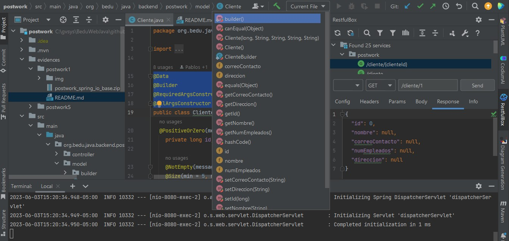

## Postwork 5

| Checklist                                                            | -   |
|----------------------------------------------------------------------|-----|
| The model classes have a generated structure by lombok annotations   | ok  |
| Mappers package and interfaces added.                                | ok  |
| The application compiles correctly and does not generate any errors. | ok  |

### Evidence

